# Professional-Portfolio

## 👤 About Me
I have built hands-on AWS cloud infrastructure projects focused on scalability, automation, monitoring, and high availability while working toward the AWS Certified Solutions Architect – Associate certification, expected in June 2026. With a bachelor’s degree in Mathematics, I bring a strong analytical mindset and enjoy solving complex technical problems through troubleshooting and infrastructure design. I am passionate about expanding my cloud engineering skills and gaining experience working with real-world AWS environments and infrastructure.

## 👤 Author

Juliet Fanik  

- GitHub: https://github.com/julietfanik  
- LinkedIn: https://www.linkedin.com/in/juliet-fanik-9a0594140/  
- Resume: [Juliet Fayez Fanik Resume](juliet-fayez-fanik-resume.pdf)

## Overview

This portfolio includes two AWS projects that focus on building and automating cloud infrastructure. Together, they demonstrate:
- Scalable architecture design
- High availability and fault tolerance
- Infrastructure-as-Code (CloudFormation)
- Monitoring and alerting with CloudWatch and SNS

---

# 🚀 Project 1: Highly Available AWS Architecture (Console Deployment)

## Overview
I designed and deployed a multi-AZ AWS architecture using EC2, an Application Load Balancer, and Auto Scaling Groups to ensure high availability and fault tolerance.

---

## Architecture Components
- 2 EC2 instances in us-east-1a and us-east-1b
- Application Load Balancer (ALB)
- Auto Scaling Group with target tracking to maintain ~50% CPU utilization
- VPC with subnets, route tables, and security groups
- CloudWatch monitoring
- SNS notifications for alerts

---

## Why This Matters
- Load balancing improves high availability by distributing traffic across multiple EC2 instances and Availability Zones.
- Auto Scaling Group with target tracking on CPU keeps performance stable during traffic spikes while avoiding over-provisioning and under-provisioning.
- CloudWatch alarms integrated with SNS notifications provide real-time monitoring and alerting for application health and infrastructure events.

---

## Key Features
- Auto Scaling policy: Automatically scales EC2 instances to maintain ~50% average CPU utilization 
- ALB health checks configured with a 30-second interval to continuously monitor instance health and remove unhealthy targets automatically.
- Simulated failure testing using unhealthy instance state and restored healthy status within 2 minutes.
- 1 EC2 user data script displays AZ-specific message:
- “Hello Juliet from AZ-A / AZ-B”
  
---
## Challenges & Solutions
- Fixed initial public exposure of 2 instances issue caused by overly permissive inbound rules by updating security groups to allow traffic only from the Application Load Balancer.
---

## Screenshots
### Application Load Balancer (ALB)
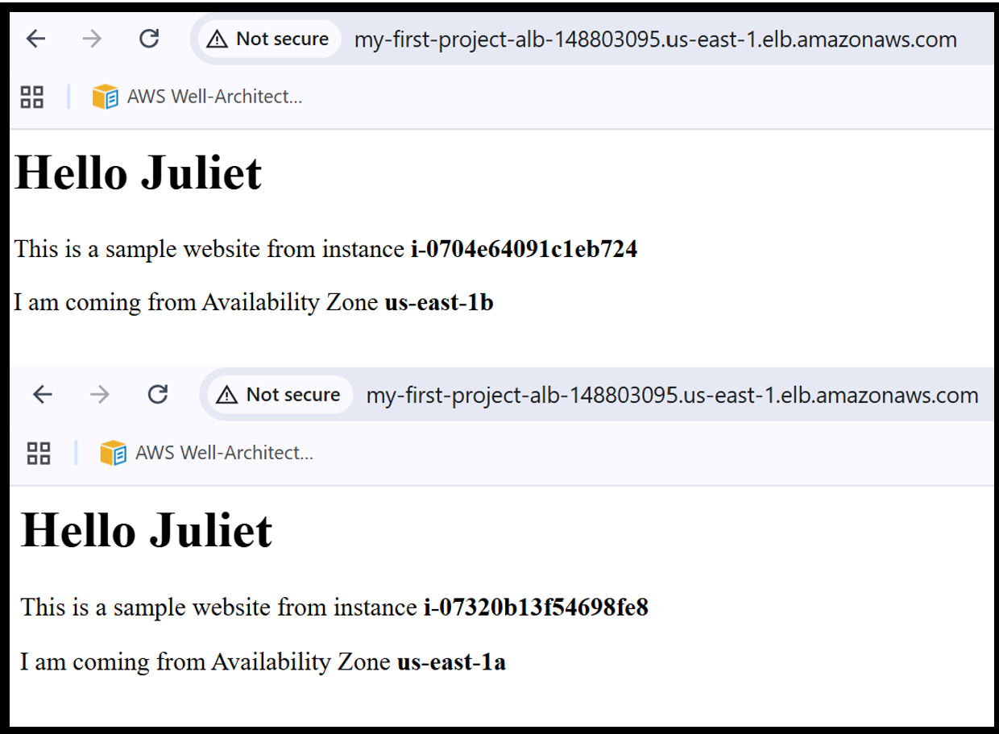
#### The ALB is successfully routing traffic to both EC2 instances in us-east-1a and us-east-1b.

---

### ALB Details
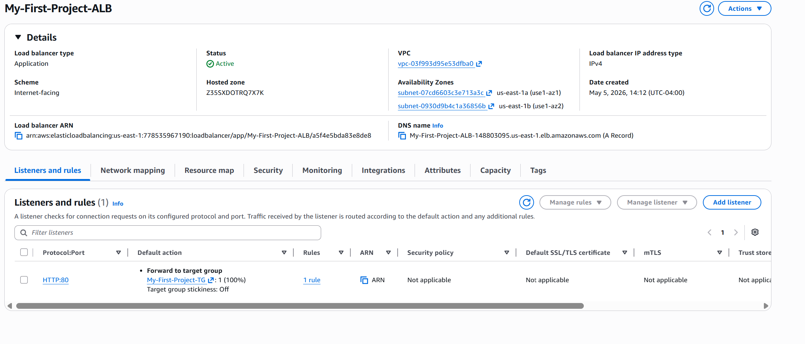
#### Shows configuration including VPC, subnets, and target group association.

---

### ALB Target Groups
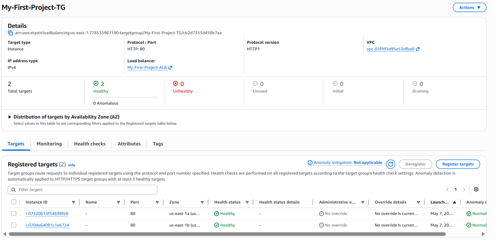
#### Both EC2 instances registered and reporting healthy status.

---

### Auto Scaling Group Details
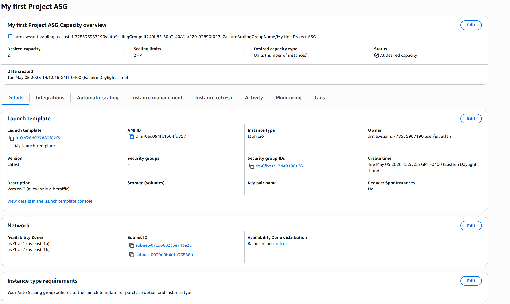
#### Displays scaling configuration, launch template, and subnet placement.
---

### Target Tracking Policy
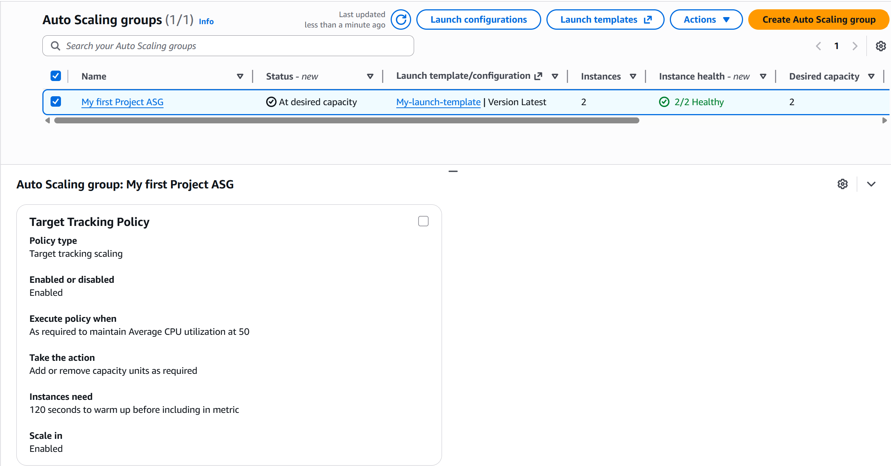
#### Scaling policy maintains average CPU utilization around 50%.

---

### Auto Scaling Group Activity
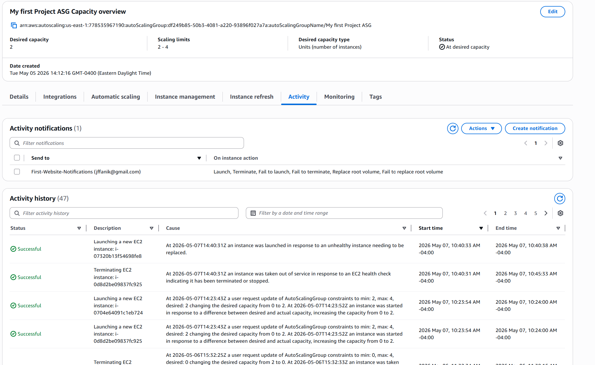
#### Logs show successful scaling events triggered by instance termination tests.

---

### CloudWatch Alarm
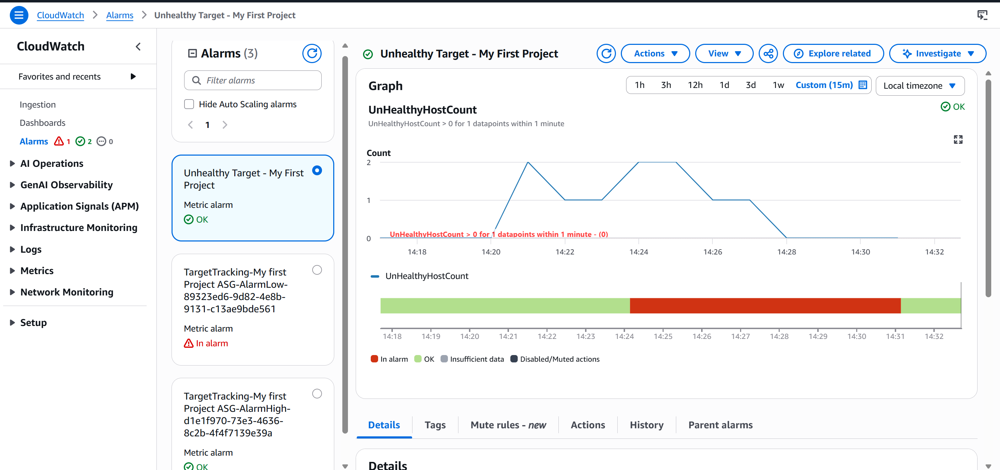
#### Alarm triggered when health check path was changed, then resolved after correction.

---

## Key Takeaways
- How ALBs distribute traffic across multiple Availability Zones
- How Auto Scaling dynamically adjusts capacity based on demand
- How CloudWatch and SNS work together for monitoring and alerts
- How to design fault-tolerant AWS architectures using core services

---

# 🚀 Project 2: Infrastructure as Code (CloudFormation)

## Overview
This project recreates the architecture from Project 1 using AWS CloudFormation to automate infrastructure provisioning and ensure consistent, repeatable deployments.

---

## 6 Services Used
- EC2 Launch Templates
- Application Load Balancer
- Auto Scaling Groups
- VPC (subnets, routing, security groups)
- CloudWatch Alarms
- SNS Notifications

---

## Key Features
- Fully automated multi-AZ deployment using CloudFormation
- Reusable Infrastructure-as-Code template for consistent provisioning
- Integrated Auto Scaling with ALB for high availability
- Centralized monitoring and alerting using CloudWatch and SNS
  
---

## What Infrastructure as Code Changes Operationally
- Defines and deploy AWS resources using code instead of manually clicking through the AWS console.
- Provides a single template that describes the entire infrastructure, making it easier to understand all resources and their relationships.
- Reviewing infrastructure as code makes it easier to identify configuration mistakes compared to manually setting up resources in the AWS console.
- Infrastructure as code makes it easier to recreate environments, update infrastructure safely, and manage cloud systems as they grow.
  
---

## Challenges & Solutions

- **Monitoring & Alerting Enhancement:**  
  - Expanded CloudWatch alarms to include `UnHealthyHostCount > 0`, improving detection of instance and application health issues. This was tested using controlled health check failures.

- **User Data Script Debugging:**  
 - Fixed formatting issues in the EC2 user data script that broke the static web page. Cleaned up the HTML and improved EC2 metadata retrieval using IMDS to show correct instance information.

---

### CloudFormation Infrastructure Template (YAML)

This CloudFormation template defines a highly available AWS architecture using EC2, an Application Load Balancer, Auto Scaling Groups, CloudWatch, and SNS. 
It provisions a highly available architecture including the following:
Application Load Balancer
Auto Scaling Group
EC2 instances
CloudWatch monitoring
SNS notifications

---

## CloudFormation Template

```yaml

Resources:

  ALBSecurityGroup:
    Type: AWS::EC2::SecurityGroup
    Properties:
      VpcId: vpc-03f993d95e53dfba0
      GroupDescription: Allow HTTP Traffic to ALB
...
```
### Full Code


---

## 📸 Screenshots  
	  
### CloudFormation Stack Creation Complete
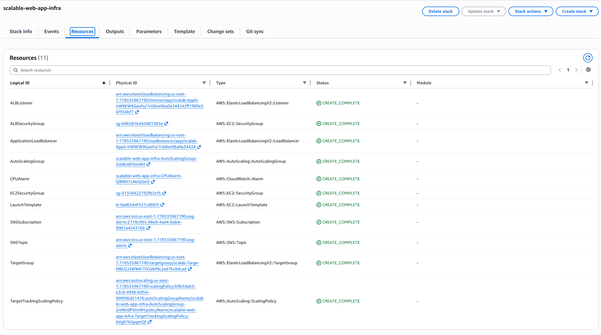
#### Stack successfully deployed with all resources created.

---

### Infrastructure Composer
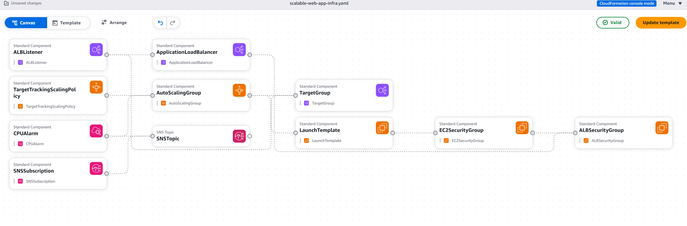
#### Visual representation of deployed architecture.
---

### Auto Scaling Group Overview
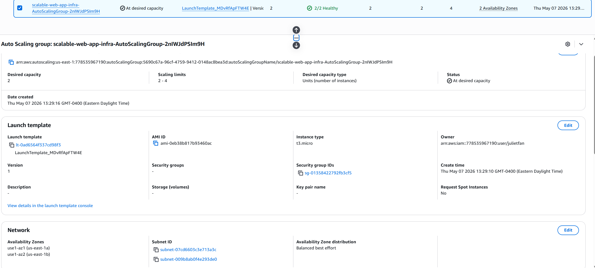
#### Shows scaling configuration and network setup.

---

### Auto Scaling Group Instance Management
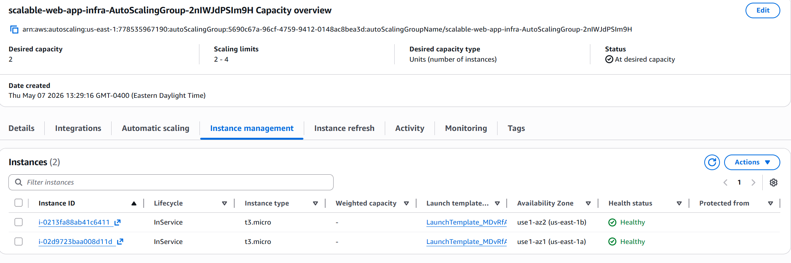
#### Two healthy EC2 instances deployed across 2 Availability Zones.

---

### Auto Scaling Instance Termination Activity
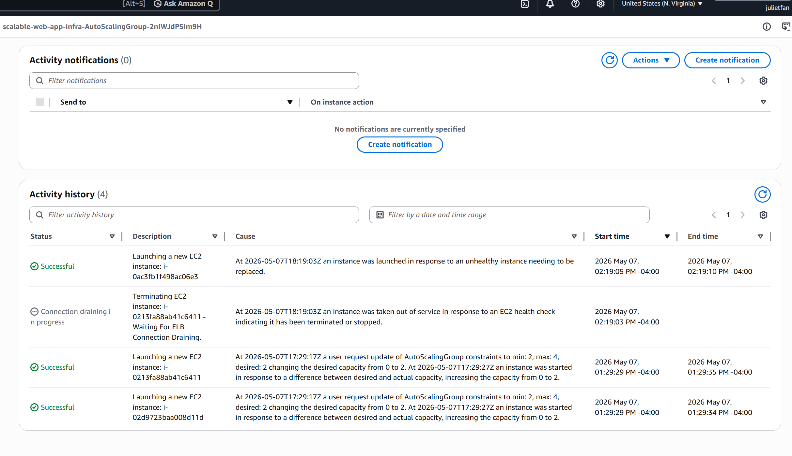
#### Successful Auto Scaling behavior after an instance was manually terminated.

---

### EC2 Security Group Rules
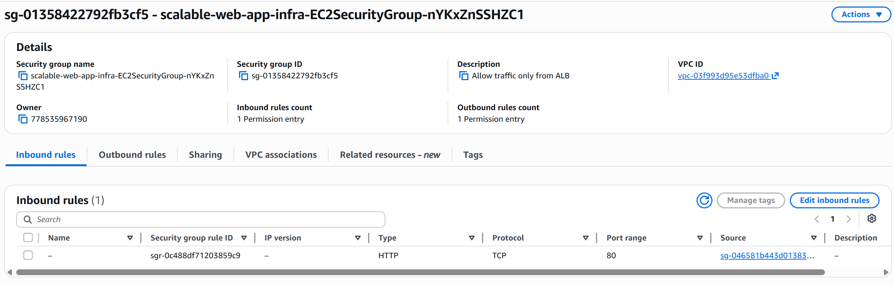
#### Security group restricts traffic to only allow ALB access.

---

### Application Load Balancer (ALB)
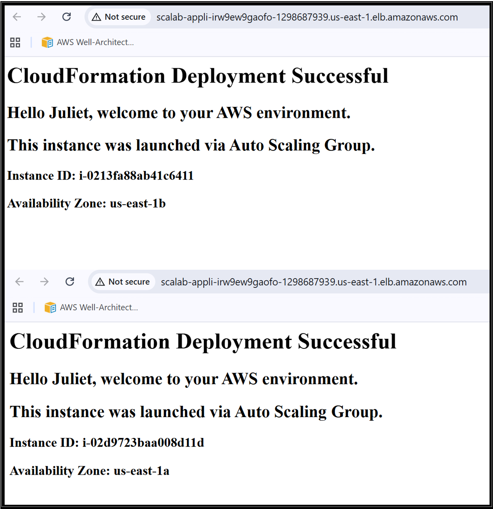
#### Successful distribution of traffic to two healthy EC2 instances. User script running successfully.

---

### ALB Overview Page
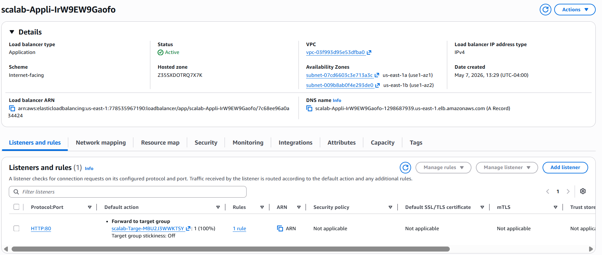
#### ALB configuration and target group association.

---

### Target Group Overview
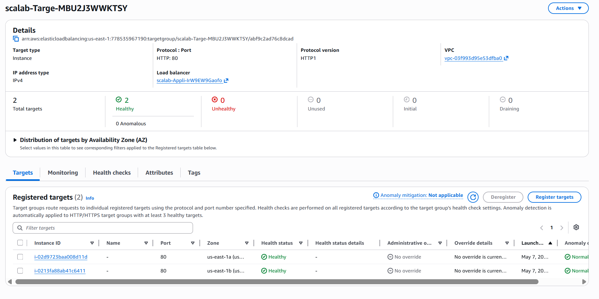
#### Registered instances and their health status within the target group.

---

### Health Check Failure Trigger
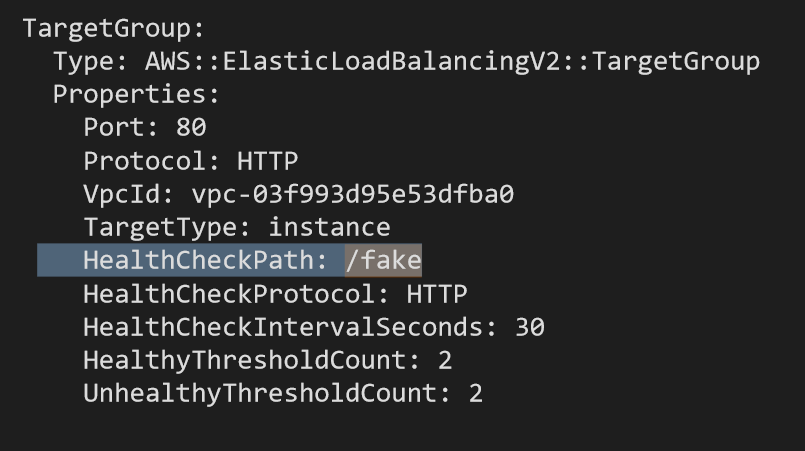
#### Health check path changed to `/fake` to simulate instance failure.

---

### Target Group Monitoring
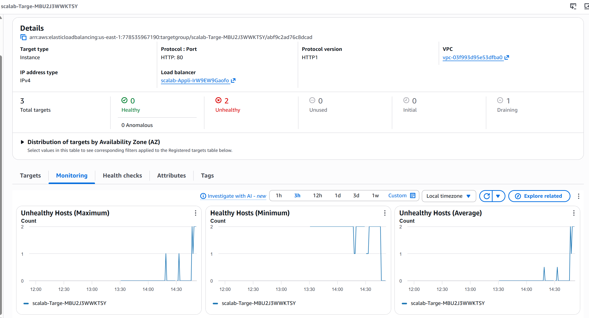
#### Shows 2 unhealthy and 2 healthy host count during failure simulation.

---

### CloudWatch Unhealthy Host Alarm
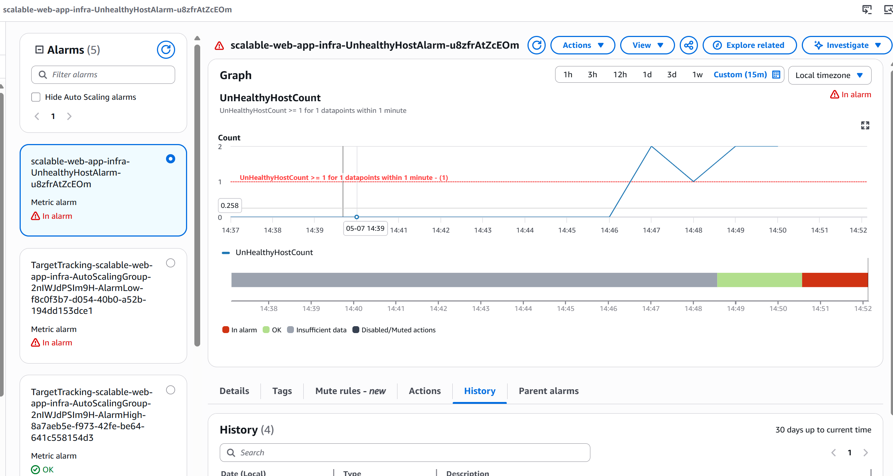
#### Alarm triggered when the target group reported 2 unhealthy instances.

---

### SNS Email Notification
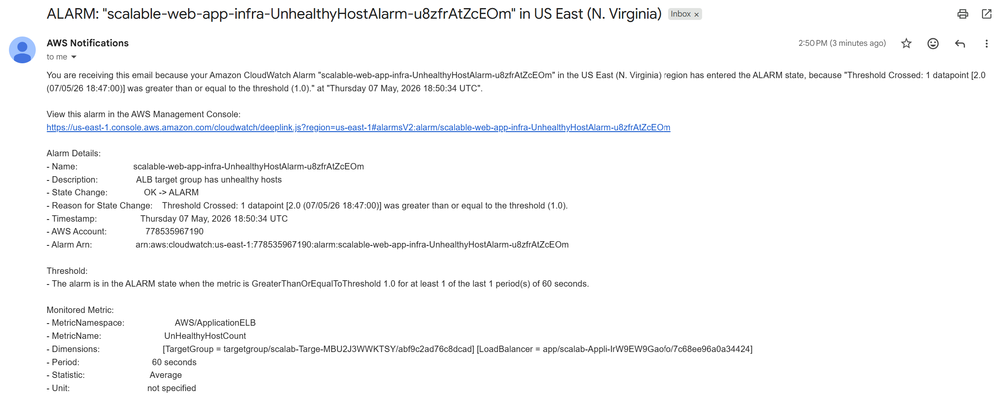
#### SNS notification triggered by the CloudWatch alarm.
---

## Key Takeaways
- How AWS resource dependencies work in IaC
- How to debug CloudFormation stack failures
- How to design repeatable infrastructure deployments
- Difference between manual vs automated infrastructure provisioning

---

# Skills Demonstrated

- AWS Cloud Architecture Design
- High Availability & Fault Tolerance
- Auto Scaling & Load Balancing
- Infrastructure as Code (CloudFormation)
- Cloud Monitoring (CloudWatch)
- Alerting Systems (SNS)
- VPC Networking Design
- Debugging AWS Deployment Issues

---

# Certification
AWS Certified Solutions Architect Associate (In Progress)  
Expected Completion: June 2026

---

